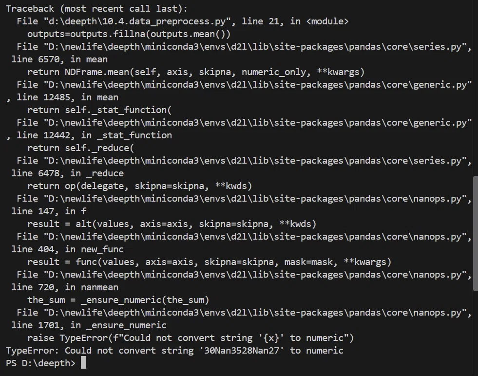

# 深度学习成长记录
## Day1 (2026.9.24)
- 看完了b站上的课程，并学习了数据操作，简单了解了一下torch
## Day2 （2026.9.27）
- 复习了一些张量代码，并打算在vs中实现。
## Day3 (2026.9.28)
打了代码了，但是主要有三类问题
**1，广播机制报错**
必须是从最右边（最后一维）开始对齐
j = torch.arange(0, 12)  # 形状是 [12]
h = torch.reshape(j, [3, 4])  # 形状是 [3, 4]
print("广播：j+h:", j+h)
这一段代码 j 的形状是j[12]，h的形状是h[3,4]，最右侧12和4并不相等，并且12也并不为1，所以无法补全导致出错
* **总结：在二维张量中行和列至少有一个相等，不相等的那个需要为1。这样才能广播**

**2.在张量相加的时候需要长度相等**
x=torch.tensor([1,2,3,4,5])
y=torch.tensor([4,5,6,7,8,9])
before=id(y)
y=y+x
id(y)==before
* **长度不相等，导致无法相加。**

**3.m.item要打印需要加括号**

## Day4 (2026.9.30 - 2026.10.5) 数据预处理

### 核心目标
将现实世界中的“脏数据”（含缺失值、非数值特征），转换为深度学习模型能够处理的“干净张量”。

### 工具包
- `pandas`：用于数据清洗和特征工程。
- `torch`：用于将处理好的数据转换为张量。

### 操作步骤

#### 1. 生成并读取原始数据
- **生成数据**：
  - 使用 `os.makedirs(os.path.join('..', 'data'), exist_ok=True)` 创建文件夹。
  - 使用 `open()` 和 `f.write()` 将数据写入 `house_tiny.csv`。
- **读取数据**：
  - 使用 `pd.read_csv(data_file)` 加载 CSV，得到 DataFrame。

#### 2. 处理缺失值（两种核心方法）
- **方法一：删除法**
  - 直接忽略含缺失值的行或列（适合缺失极少的数据）。
- **方法二：插值法**（最常用，重难点）
  - **第一步：拆解数据**：使用 `iloc` 将数据拆分为输入（`inputs`）和输出（`outputs`）。
  - **第二步：分类处理**（这是最容易踩坑的地方）：
    - **数值列（如 `NumRooms`）**：使用均值填充。
    代码：`inputs['NumRooms'] = inputs['NumRooms'].fillna(inputs['NumRooms'].mean())`。
    - **非数值列（如 `Alley`）**：使用独热编码。
    代码：`inputs = pd.get_dummies(inputs, dummy_na=True)`。
  - **第三步：转换为张量**：`torch.tensor(inputs.values)`。

#### 3. 独热编码（One-Hot Encoding）深度理解
- **核心逻辑**：扫描整表 → 找出唯一值 → 拆列生成（出现为1，未出现为0）→ 删掉原列。
- **`dummy_na` 参数的作用**：
  - `dummy_na=True`：把缺失值（NaN）本身也当成一种特征类别，单独开一列。
  - `dummy_na=False`：把 NaN 当空气，缺失的行在新列里全为0。
- **学术总结**：适用于“无序的定性特征（Nominal Categorical）”、“离散型特征（Discrete）”、“输入特征（Input Features）”。
- **白话总结**：无序的，同级的，是特征。

###  代码深度解析与避坑

#### 1. `os.makedirs(os.path.join('..', 'data'), exist_ok=True)`
- `os.path.join`：纯字符串拼接函数，用当前操作系统的路径分隔符连接参数。
- `os.makedirs`：系统 API 调用，尝试在硬盘上创建目录。
- `exist_ok=True`：关键字参数。若目录已存在，则静默跳过，不抛出 `FileExistsError`。
- **执行本质**：调用了系统 API，产生了物理副作用（创建了文件夹）。

### 4.inputs = pd.get_dummies(inputs, dummy_na=True)
- 1.扫描全表，检查数据类型
- 2.找出选项:针对符合独热代码条件的那一项，pandas会手机里面所有出现过的不重复的值。
- 3.拆列:生成新列，出现几个值就出现几个列，对比每列所代表的值，是这个值输入1，不是这个值则输入e。然后把原来的列直接删掉
- 4.括号中多出来的参数的作用:
    dummy_na=True:让缺失值本身也是一种特征类别
    dummy_na=False:把NaN当作空气直接五列。让缺失的那一行正在新列上都是e。
- 5.重新赋值:把做完变动的新表格覆盖原来的变量

#### 3. `pd.get_dummies()` 的传入陷阱
- **错误写法**：`inputs = pd.get_dummies(inputs['Alley'], dummy_na=True)`
  - **后果**：只取了 `Alley` 这一列，处理完赋值给 `inputs` 时，**会把原来的 `NumRooms` 列直接覆盖丢掉！**
- **正确写法**：`inputs = pd.get_dummies(inputs, dummy_na=True)`
  - **解释**：传入整个表，pandas 会自动扫描：数值列原封不动保留，文本列自动做独热编码。
- **如果需要单独处理某列并拼接**：
  ```python
  temp_alley = pd.get_dummies(inputs['Alley'], dummy_na=True)
  inputs = pd.concat([inputs['NumRooms'], temp_alley], axis=1)

### 报错处理
- ：NAN的拼写错误，拼写成为Nan。
  - 解决一：将拼写改正为NaN。
  - 解决二：`data = pd.read_csv(data_file, na_values=['Nan'])`
- 没有删除缺失值最多的列：
  `most_missing=data.isnull().sum().idxmax()`
  `data=data.drop(columns=[most_missing])`  
  **分析**
  `data.isnull`：检查表格里的每个格子是不是空的，若是空的则标为True，否则为False.
  `.sum`：对上一步的True（1）和False（0）表格求和。
  `idxmax`：找出最大值对应的索引（列名）
  `data.drop`：用来删除的函数
  `columns=[most_missing]`：要删除东西的列表

## Day5（2026.10.5）线性代数
### 概念理解
- **标量**：函数中的确定值
